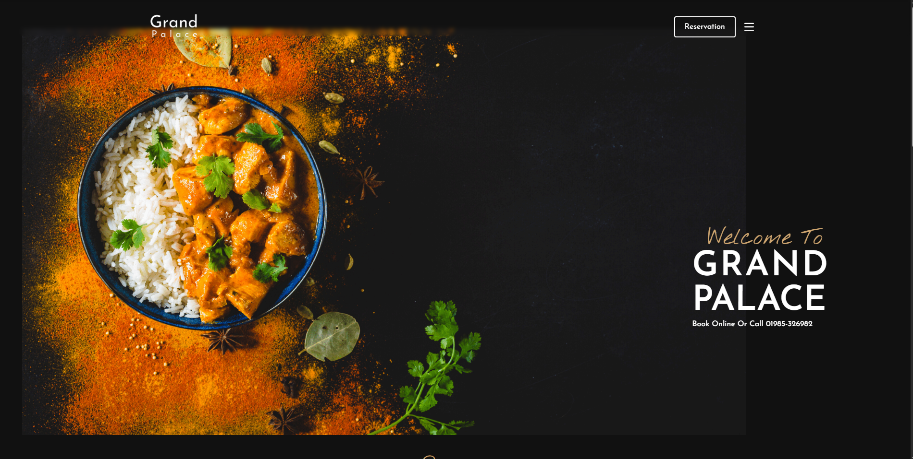

# 🍽️ Responsive Restaurant Website

This is a responsive **restaurant website** built using **HTML**, **Tailwind CSS**, and **JavaScript**. I created this project while learning to build real-world layouts and enhance my frontend development skills.

## ✨ Features

- 📱 **Responsive Design:** Works seamlessly across devices (mobile, tablet, desktop)
- 🧾 **Menu Section:** Showcasing food items with pricing and categories
- 📸 **Hero Section:** Eye-catching intro with background image and call to action
- 📍 **Contact Section:** Simple layout for location, hours, and contact info
- 🎯 **JavaScript Features:** Interactive elements (e.g., menu filters, scroll effects, etc.)

## 🛠️ Built With

- **HTML**
- **Tailwind CSS**
- **JavaScript**

## 📸 Preview

 <!-- Add a screenshot of your site here -->

## 🚀 Getting Started

To run locally:

```bash
git clone https://github.com/your-username/restaurant-website.git
cd restaurant-website
# Open index.html in your browser
